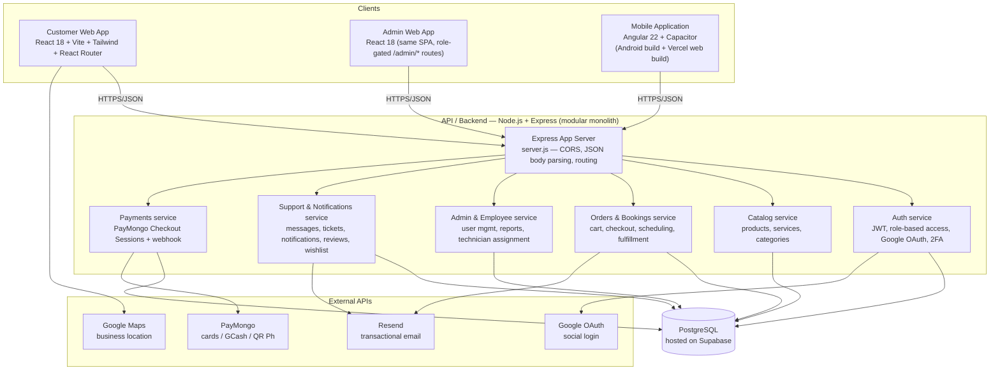

# HomeLink — High-Level System Architecture

HomeLink is a home-improvement marketplace: customers buy products and book installation/maintenance
services from one platform, with separate portals for customers, employees, and admins, plus a
companion mobile app.

## Diagram

> The backend is a single Express service organized into route modules (auth, products, services,
> orders, bookings, admin, employee, addresses, payment-methods, reviews, support, notifications,
> messages, wishlist, cart, payments) rather than independently deployed microservices. The diagram
> groups them as logical "services" within that one process for clarity — deploying them as separate
> services is a possible future step, not the current state.

## Components & Technology

| Component | Technology | Notes |
|---|---|---|
| Customer Web App | React 18, Vite, Tailwind CSS, React Router | Deployed on Vercel |
| Admin Web App | React 18 (same codebase as customer app, `/admin/*` routes) | Separate login at `/admin/login` |
| Mobile Application | Angular 22, Capacitor, Tailwind CSS, RxJS | Packaged as an Android app via Capacitor; also deployed as a web build on Vercel |
| API / Backend | Node.js, Express, JWT auth | Modular monolith, deployed on Render |
| Database | PostgreSQL (Supabase) | Accessed via `pg`; previously ran on SQLite (local dev) / Neon before settling on Supabase |
| External APIs | Resend, Google Maps, Google OAuth, PayMongo | See below |

### External API usage

- **Resend** — order/booking confirmation emails, password reset, verification codes
- **Google Maps** — renders the business location on the customer site
- **Google OAuth** — social sign-in alongside email/password
- **PayMongo** — hosted Checkout Sessions for card, GCash, and QR Ph payments, plus a webhook
  (`POST /api/payments/webhook`) for payment status confirmation

## Deployments

| Surface | URL |
|---|---|
| Customer/Admin Web App (frontend) | https://homelink-frontend-umber.vercel.app |
| Backend API | https://homelink-backend-vwg8.onrender.com |
| Mobile app (web build) | https://homelink-mobile-app.vercel.app |
| GitHub repository | https://github.com/AdrianEstrecho/Homelink |
